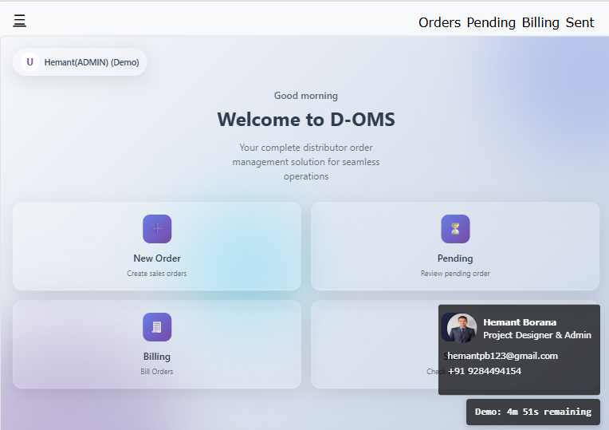
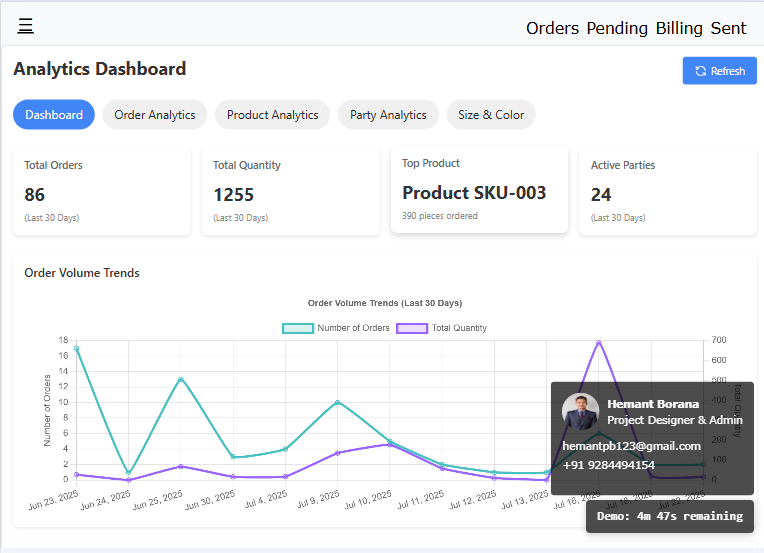
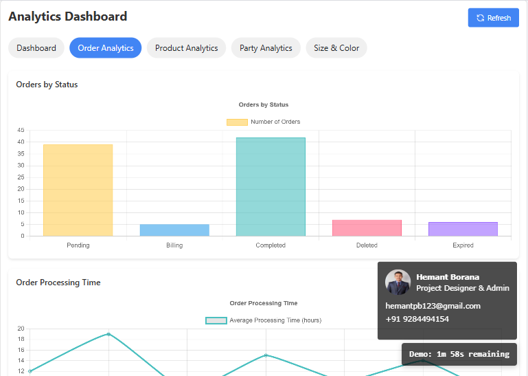
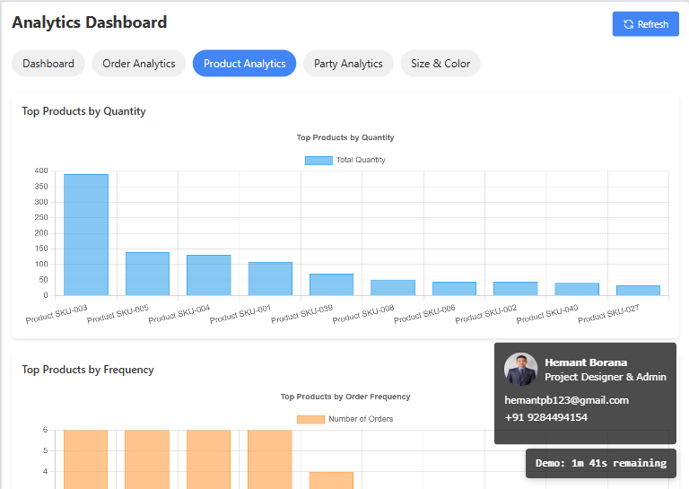
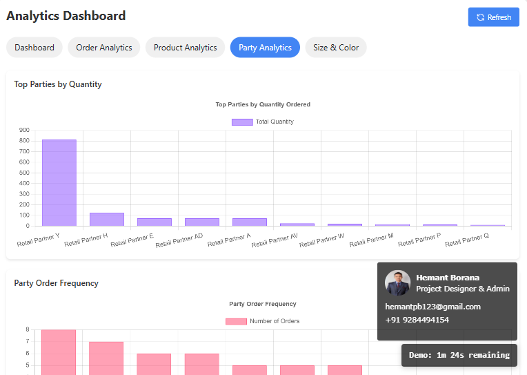
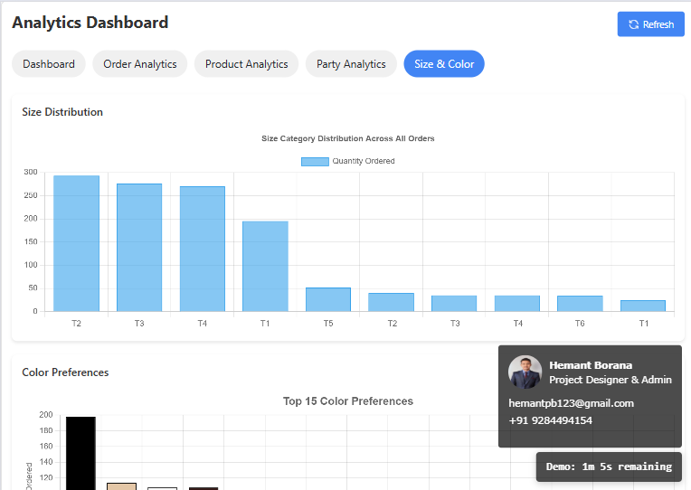
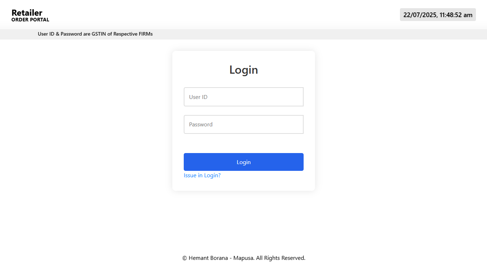
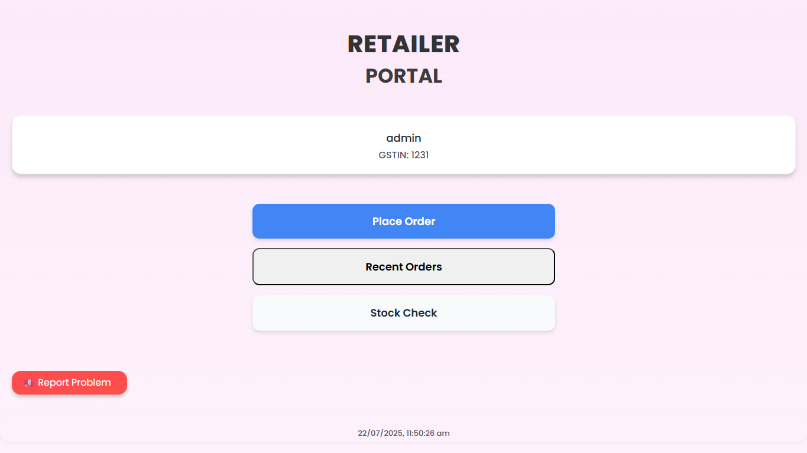
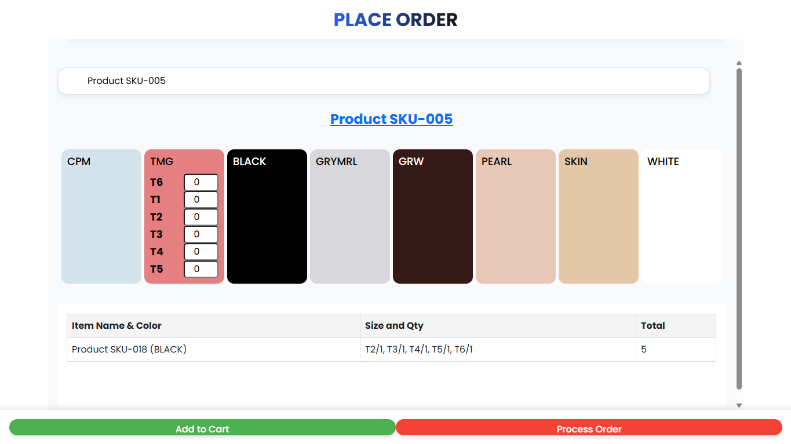
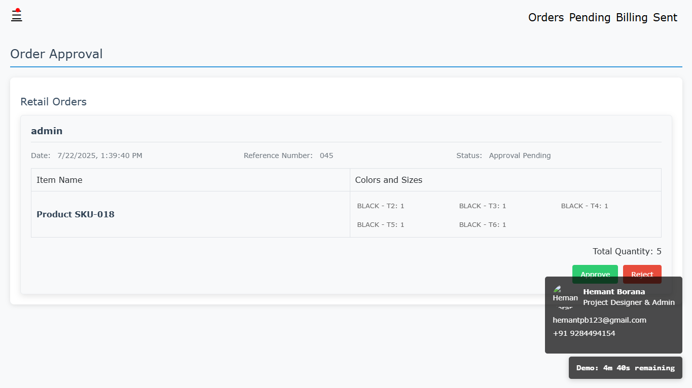

# D-OMS: Complete Order Management System with Advanced Analytics

**🏢 INTEGRATED BUSINESS ECOSYSTEM - TWO SYNCHRONIZED APPLICATIONS**

## Live System Links

**Production Status:** D-OMS: 12+ Months Active | Retailer Portal: 3+ Months Active

---

## 🎯 Project Overview

D-OMS is a **production-ready, full-stack Order Management System** with integrated **Advanced Analytics Dashboard**, developed for our family distribution business. The system has been successfully managing real business operations for over **12 months**, processing daily orders and providing comprehensive business intelligence.

**Demo Version:** Uses a **30-day anonymized dataset** where sensitive information (product names, customer details, API keys) has been replaced with generic equivalents to protect business confidentiality.

**Key Achievement:** Transformed traditional paper-based operations into a fully digital, data-driven business platform processing **150+ products** across **50+ retail parties**.

---

## 🏪 Main D-OMS System

### Core System Features

**4-Stage Digital Workflow:**
1. **Order Creation** → Real-time stock validation and customer verification
2. **Pending Review** → Order queue management and priority processing
3. **Billing Process** → Order processing with barcode scanning integration
4. **Sent/Delivered** → Complete delivery tracking and records

**Key Modules:**
- **Order Management** - New order creation, pending queue, approval workflow
- **Stock Management** - Real-time inventory tracking across 150+ products with size/color variants
- **Billing System** - Queue management, barcode scanning, order remarks, deletion capability
- **User Management** - Admin-controlled access, user approval system, order attribution tracking

---

## 📊 Advanced Analytics Dashboard

> **Business Intelligence Core**: Transforms operational data into actionable insights using 30-day anonymized dataset demonstrating full analytics capabilities.

### Analytics Modules

#### 1. Executive Dashboard & KPIs
- Real-time business performance monitoring
- Total orders processed and volume analysis
- Active customer base tracking
- Top-performing product identification

#### 2. Order Analytics

- **30-Day Trend Analysis** - Seasonal patterns and peak periods
- **Order Status Distribution** - Processing stage analytics
- **Processing Efficiency Metrics** - Workflow bottleneck identification
- **Volume vs Quantity Analysis** - Operational planning insights

#### 3. Product Performance Intelligence

- **Demand Ranking** - Performance across 150+ product catalog
- **Frequency Analysis** - Most frequently ordered items
- **Color & Size Intelligence** - Distribution patterns and preferences
- **Product Lifecycle Analysis** - Performance tracking over time

#### 4. Customer Behavior Analytics

- **Customer Performance Ranking** - Volume and frequency analysis
- **Behavioral Segmentation** - Three distinct customer types identified
- **Customer Lifetime Value** - Top 20% generate 70% of business volume
- **Product Preference Mapping** - Party-specific demand patterns

#### 5. Inventory Intelligence

- **Demand vs Stock Analysis** - Inventory level optimization
- **Color Popularity Trends** - 60% seasonal variation patterns
- **Size Distribution Intelligence** - Stock allocation optimization
- **Procurement Planning Tools** - Data-driven inventory recommendations

---

## 🏪 Retailer Portal - B2B Integration

> **Integrated B2B Ecosystem**: Dedicated portal enabling retail partners to place orders directly into the main distribution system.

**Note:** *Contains sensitive business credentials - not available for public demo. Screenshots show sanitized frontend interface.*

### Portal Features

#### Authentication & Dashboard

**Core Functions:**
- **📋 Order Placement** - Direct ordering interface
- **📊 Recent Orders** - Order history and tracking  
- **📦 Stock Inquiry** - Real-time inventory visibility

#### Advanced Order System

- **Product Selection** - Same 150+ product database as main system
- **Shopping Cart Functionality** - Add/remove/modify capabilities
- **Security Verification** - Case-sensitive captcha for order authenticity
- **Direct Integration** - Orders flow into main D-OMS system

#### Integration Workflow

1. **Retailer Submission** → Orders appear in main system "Order Approval" section
2. **Admin Review** → Manual approval required (admin password protected)
3. **Accept/Reject** → Admin decision with reason tracking
4. **Auto-Integration** → Approved orders enter main system "Pending" queue
5. **Standard Processing** → Follow same billing → sent workflow

---

## 🛠️ Technical Architecture

### Frontend Technologies
- **HTML, CSS, JavaScript** - Modern web standards
- **Progressive Web App (PWA)** - Installable application (production only)
- **Responsive Design** - Mobile-first approach
- **Chart.js Integration** - Professional data visualization

### Backend & Database
- **Firebase Realtime Database** - Cloud-based real-time synchronization
- **IndexedDB Integration** - Smart caching system:
  - Checks if stock data changed since last update
  - Updates from Firebase only when necessary
  - Reduces Firebase downloads and improves performance
- **Hierarchical Data Structure** - Optimized JSON for complex queries
- **Firebase Security Rules** - Protected data access

### Analytics Stack
- **Multi-dimensional Processing** - Complex analytical queries
- **Time-Series Analysis** - Trend identification and forecasting
- **Interactive Components** - Real-time dashboard updates
- **Export Capabilities** - PDF and Excel report generation

### Demo vs Production Differences
**Demo Features:**
- Complete order management workflow
- Full analytics dashboard with 30-day dataset
- All core system functionality

**Production-Only (Removed from Demo):**
- Telegram bot integration (API keys removed)
- WebPush notifications (service keys removed)
- Retailer portal access (sensitive credentials)
- Real business data (actual products, customers, pricing)

---

## 📈 Business Impact & Results

### Operational Transformation
- **100% Paperless Operations** - Eliminated manual processes
- **~50% Reduction** in order processing time
- **Automated Validation** - Significantly reduced billing errors
- **Real-Time Decision Making** - Live analytics dashboard

### B2B Integration Benefits
- **60% Reduction** in manual order entry
- **45% Decrease** in order errors through digital validation
- **Enhanced Customer Experience** - Real-time order tracking
- **Streamlined Operations** - Automated approval workflows

### Analytics-Driven Insights
**Product Intelligence:**
- Top performers (Product SKU-003, SKU-004) drive 40% of demand
- Seasonal color preferences show 60% variation
- Optimal stock ratios identified across all products

**Customer Segmentation:**
- Three distinct customer behavior patterns identified
- Top 20% customers generate 70% of business volume
- Party-specific preferences enable targeted strategies

---

## 🚀 Technical Challenges Overcome

### Performance Optimization
**Challenge:** Processing analytics for 150+ products with 12+ months of data  
**Solution:** Efficient IndexedDB caching and optimized Firebase queries  
**Result:** Sub-second chart rendering with real-time updates

### Real-time Analytics
**Challenge:** Live business intelligence without performance impact  
**Solution:** Smart data processing with intelligent caching strategies  
**Result:** Real-time insights without operational system slowdown

### B2B System Integration
**Challenge:** Seamless retailer portal integration with main system  
**Solution:** Unified database architecture with automated approval workflows  
**Result:** Complete digital ecosystem eliminating manual order processing

---

## 💡 Skills Demonstrated

### Data Analytics Lifecycle
- **Data Collection & Management** - Real-time capture and multi-source integration
- **Statistical Analysis** - Time-series, correlation, and distribution analysis
- **Data Visualization** - Professional dashboards and interactive charts
- **Business Intelligence** - KPI development and strategic insights generation

### Full-Stack Development
- **Frontend Development** - Responsive web applications and PWA
- **Backend Architecture** - Real-time databases and API integration
- **System Integration** - Multi-application ecosystem development
- **Security Implementation** - Access control and authentication systems

### Business Value Creation
- **Requirements Analysis** - Business needs to technical solutions
- **Production Deployment** - Live system maintenance and scaling
- **User Training & Adoption** - Stakeholder onboarding and support
- **Measurable ROI** - Quantified business improvements and efficiency gains

---

## 📞 Contact Information

**Developer:** Hemant Parasmal Borana  
**Email:** hemantpb123@gmail.com  
**Phone:** +91 9284494154

**Portfolio Links:**
- 🌐 **Live Demo:** [D-OMS System](https://hemantborana.github.io/D-OMS/)
- 💻 **Source Code:** [GitHub Repository](https://github.com/hemantborana/D-OMS)

---

**This comprehensive Order Management System represents 12+ months of real-world business application development, demonstrating production-ready solutions that transform operational data into strategic business intelligence with measurable impact across the entire supply chain ecosystem.**
